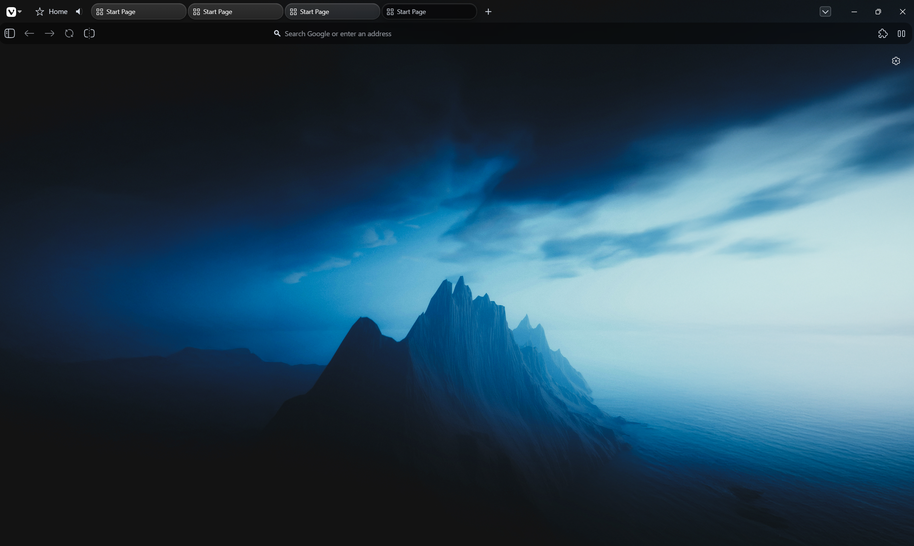

# Glassy Vivaldi
A Liquid Glass Based Theme for the Vivaldi Browser

---

# Screenshots

---

# Usage

Just install the CSS file (clone or download) and then follow these steps to change your vivaldi css

https://vivaldi.com/blog/tips/tip-9/

After completing above steps, add the css file to the folder you chose to store your custom css

---

Modified and inspired from VivaldiAir - 
https://github.com/MohamedxSalah/Vivaldi-Air
